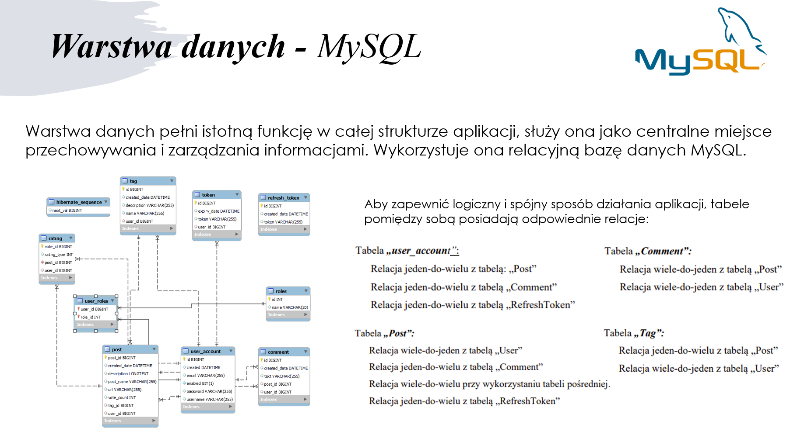
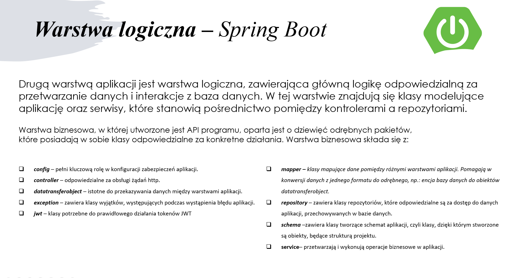
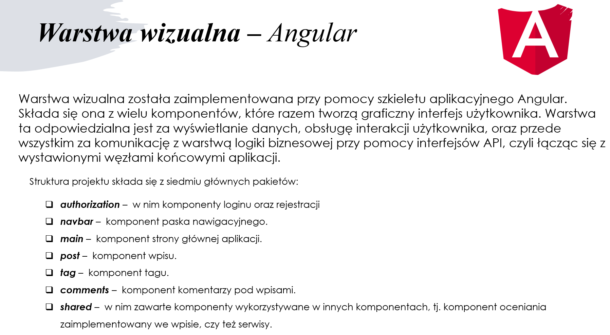
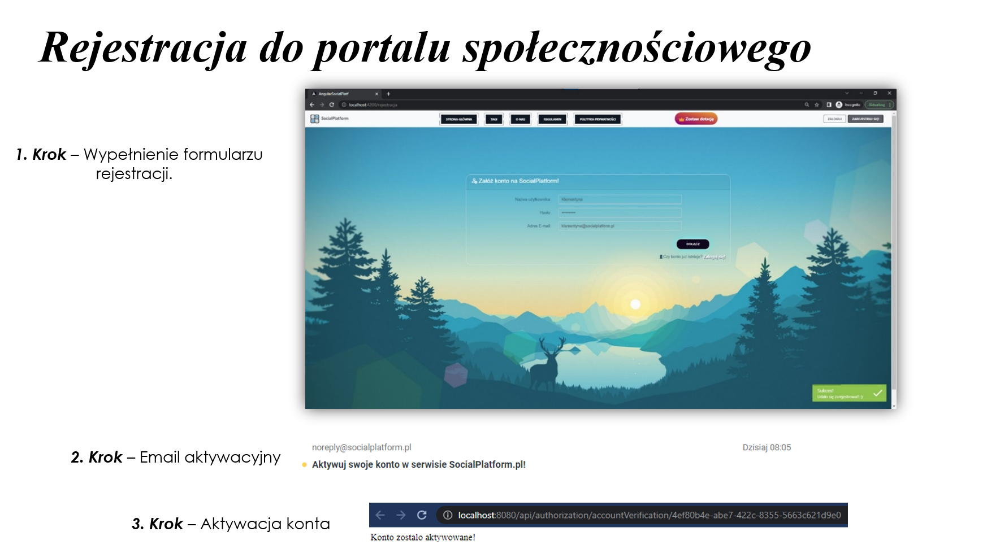
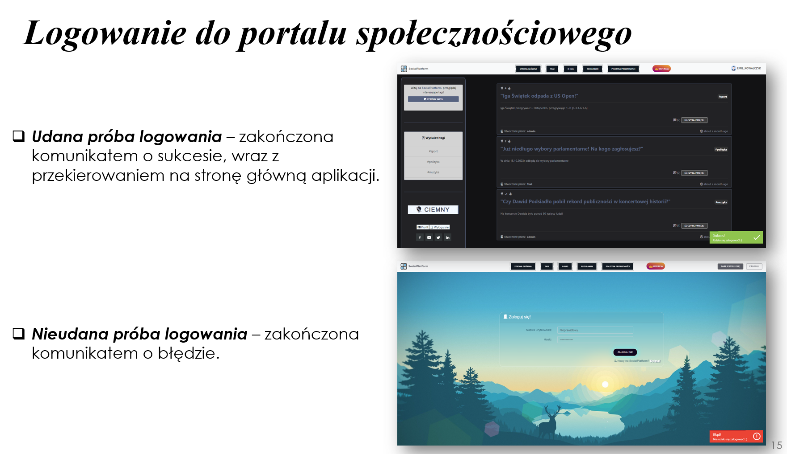
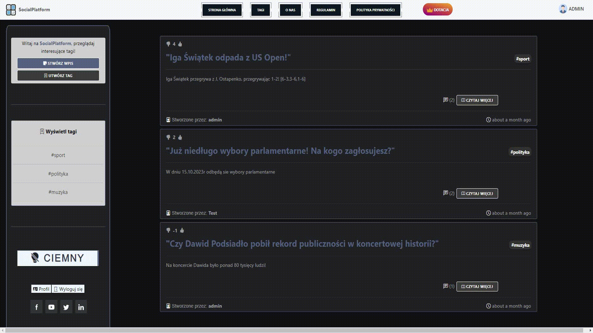
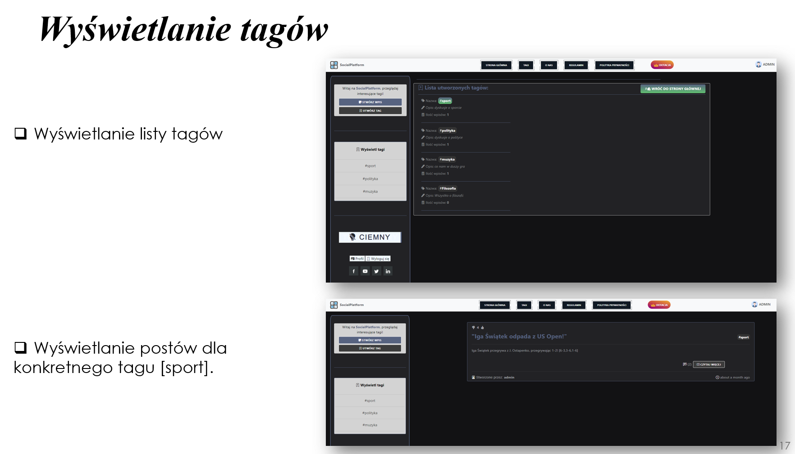
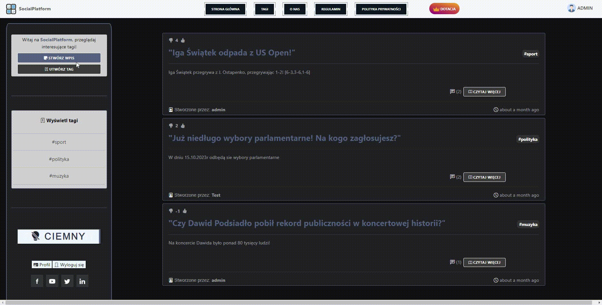

# 💻:iphone: socialPlatform - Portal Społecznościowy

### 💦 Wykorzystane technologie:
◼️ Java ◽  Spring Boot ◽  Angular  ◽ MySQL  ◽ Bootstrap  ◽ AWS ◼️

-------------------------------------------------------------------
🎯 Cel i założenia projektu
------------------------------
Celem mojej pracy jest przedstawienie możliwości technologii Angular i Spring Boot przy budowie portalu społecznościowego. Metodą badawczą było zaprojektowanie aplikacji internetowej, przy użyciu technologii Angular i Spring Boot, a założonym efektem, było stworzenie pełnej aplikacji internetowej, w oparciu o logikę biznesową oraz interfejs graficzny, wykonanych przy zastosowaniu
wyżej wspomnianych technologii. Utworzony portal społecznościowy, ma charakter dyskusyjny, na któym użytkownicy mogą wyrażać swoje opienia na forum publicznym.

---------------------------------------------------------------------

🎲 Architektura aplikacji - MVC (Model-View-Controller)
------------------------------
Struktura aplikacji jest zbudowana w oparciu o trzy główne warstwy, które współpracują ze sobą, aby zapewnić pełną funkcjonalność aplikacji, są to:
- Warstwa danych
- Warstwa logiki biznesowej.
- Warstwa wizualna

:orange_book: Warstwa danych - MySQL
------------------------------

<b>Obraz 1. Warstwa danych, przy wykorzystaniu RDBMS - "MySQL".</b>  

:green_book: Warstwa logiki biznesowej - Spring Boot
------------------------------

<b>Obraz 2.</b>  Warstwa logiki biznesowej, przy zastosowaniu szkieletu aplikacyjnego: "Spring Boot". 

:closed_book: Warstwa danych - Angular
------------------------------

<b>Obraz 3.</b>  Warstwa wizualna aplikacji, przy zastosowaniu szkieletu aplikacyjnego: "Angular". 

:bookmark_tabs: Wymagania aplikacji
------------------------------
Wymagania aplikacji, można podzielić na wymagania funkcjonalne, które dotyczą sposobu działania systemu. Opisują one jak system powinien reagować na konkretne
żądania, wysyłane przez użytkowników aplikacji, oraz na wymagania niefunkcjonalne, które opisują ogólną jakość wytworzonej aplikacji.

#### 💨 Wymagania funkcjonalne
Do wymagań <b> funkcjonalnych </b>, które omawiają funkcje, które implementuje aplikacja internetowa – Social Platform, można zaliczyć:

- Wyświetlanie ekranu głównego  💻
- Rejestracja konta w serwisie: SocialPlatform.pl :registered:
- Logowanie do serwisu :alien:
- Dodawanie wpisów :newspaper:
- Dodawawanie komentarzy pod wpisami :black_nib:
- Tworzenie znaczników :white_check_mark:
- Ocena wpisów (Plusowanie / Minusowanie) :heavy_plus_sign: :heavy_minus_sign:
- Ustawianie ciemnego motywu strony :black_square_button:
- Wylogowanie użytkownika :no_entry_sign:
- Przeznaczenie dobrowolnej dotacji :credit_card:

#### 💨 Wymagania niefunkcjonalne
Do wymagań <b> niefunkcjonalnych </b>, prezentujących ogólną jakość wytworzonej aplikacji, można zaliczyć między innymi:
 - <b> Kompatybilność </b> - serwis działa na znanych technologiach, czyli ogólnie używanych klientach, w tym przypadku przeglądarki internetowe oparte na silniku Chromium, silnik przeglądarkowy Gecko. Przez fakt, iż jest to aplikacja internetowa dostęp powinien być możliwy z każdego popularnego systemu operacyjnego! 
 - <b> Język aplikacji </b>- aplikacja dziala w języku polskim. 
 - <b> Bezpieczeństwo </b> - dane użytkownika, takie jak hasło powinno być poufne i odpowiednio zaszyfrowane. 
 - <b> Modularna aplikacja </b> - aplikacja powinna składać się z trzech niezależnych warstw, reprezentujących model danych, interfejs (API) oraz warstwę graficzną. 
 - <b>Prostota </b> - serwis powinien być intuicyjny w obsłudze. Zarówno funkcjonalności powinny być proste, jak i warstwa graficzna aplikacji. 
 - <b> Wydajność </b> - Ządania aplikacji powinny być wykonane bardzo szybko.

-------------------------------------------------------------------
📲 Aplikacja od strony klienta końcowego
-------------------------------------------------------------------
<h3> :registered: Rejestracja </h3>

<b>Obraz 4. Rejestracja w serwisie</b>  

-------------------------------------------------------------------
<h3> :alien: Logowanie </h3>

<b>Obraz 5. Logowanie do serwisu</b>  

-------------------------------------------------------------------
<h3> 📋 Tworzenie tagu </h3>

<b>Obraz 6. Tworzenie tagu </b>  

-------------------------------------------------------------------
<h3> 📋 Wyświetlanie tagów </h3>

<b>Obraz 7. Wyświetlanie tagów w serwisie SocialPlatform </b>  

-------------------------------------------------------------------
<h3> :newspaper: Dodawanie wpisu </h3>

<b>Obraz 8. Dodawanie wpisu w serwisie SocialPlatform </b>  

-------------------------------------------------------------------
<h3> 🗃 Pozostałe funkcjonalności </h3>

<b>Obraz 9. Ogólne działanie serwisu SocialPlatform </b>  

<h5 align="right"> :copyright: Wykonane przez: Emil Kowalczyk </h5>
